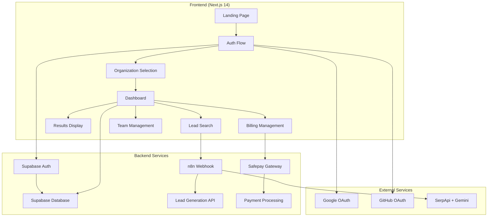

# Design Document

## Overview

Evo Lead AI is architected as a modern, multi-tenant SaaS application built on Next.js 14 with App Router, leveraging Supabase for backend services and implementing a clean, organization-centric data model. The system prioritizes security through OAuth-only authentication, data isolation through Row Level Security (RLS), and seamless user experience through responsive design and real-time updates.

The architecture follows a component-based approach with clear separation of concerns: authentication flows, organization management, lead generation workflows, and billing integration. The design emphasizes scalability, maintainability, and user experience consistency across all touchpoints.

## Architecture

### High-Level System Architecture



### Data Flow Architecture

1. **Authentication Flow**: OAuth providers → Supabase Auth → User profile creation → Organization assignment
2. **Lead Generation Flow**: Search form → n8n webhook → SerpApi + Gemini → Results storage → UI display
3. **Multi-tenancy Flow**: Organization context → RLS policies → Scoped data access → UI updates
4. **Billing Flow**: Plan selection → Safepay integration → Payment confirmation → Credit allocation

### Technology Stack Integration

- **Frontend**: Next.js 14 App Router with TypeScript for type safety
- **Styling**: Tailwind CSS with custom design system components
- **Animation**: Framer Motion for smooth transitions and micro-interactions
- **State Management**: React Context for organization state, Zustand for complex client state
- **Database**: Supabase with PostgreSQL and real-time subscriptions
- **Authentication**: Supabase Auth with OAuth providers
- **API Integration**: Custom hooks for n8n webhook and Safepay integration

## Components and Interfaces

### Core Component Hierarchy

```
App Layout
├── AuthProvider (Context)
├── OrganizationProvider (Context)
├── ThemeProvider (Context)
└── Main Application
    ├── LandingPage
    ├── AuthPages
    │   ├── OAuthLogin
    │   ├── OrganizationSetup
    │   └── OrganizationSelector
    ├── Dashboard
    │   ├── Navigation
    │   │   ├── Navbar
    │   │   └── Sidebar
    │   ├── SearchInterface
    │   │   ├── SearchForm
    │   │   └── FilterControls
    │   ├── ResultsDisplay
    │   │   ├── LeadCard
    │   │   ├── ExportControls
    │   │   └── PaginationControls
    │   ├── BillingManagement
    │   │   ├── PlanSelector
    │   │   ├── PaymentForm
    │   │   └── BillingHistory
    │   └── TeamManagement
    │       ├── MemberList
    │       ├── InviteForm
    │       └── RoleManagement
    └── SharedComponents
        ├── LoadingStates
        ├── ErrorBoundaries
        ├── EmptyStates
        └── ConfirmationModals
```

### Key Interface Definitions

```typescript
// Core Types
interface User {
  id: string;
  email: string;
  full_name: string;
  avatar_url: string;
  created_at: string;
}

interface Organization {
  id: string;
  name: string;
  owner_id: string;
  plan: 'trial' | 'starter' | 'growth' | 'agency';
  credits: number;
  trial_searches_used: number;
  created_at: string;
}

interface Lead {
  id: string;
  organization_id: string;
  business_name: string;
  email: string;
  phone: string;
  website: string;
  confidence_score: number;
  search_id: string;
  created_at: string;
}

interface SearchRequest {
  business_type: string;
  country: string;
  state: string;
  city: string;
  leads_requested: 30 | 100 | 300 | 500;
}

// Context Interfaces
interface AuthContextType {
  user: User | null;
  loading: boolean;
  signInWithOAuth: (provider: 'google' | 'github') => Promise<void>;
  signOut: () => Promise<void>;
}

interface OrganizationContextType {
  activeOrganization: Organization | null;
  userOrganizations: Organization[];
  switchOrganization: (orgId: string) => void;
  createOrganization: (name: string) => Promise<Organization>;
  joinOrganization: (inviteCode: string) => Promise<void>;
}
```

### Component Design Patterns

**1. Compound Components Pattern**
- SearchInterface combines SearchForm + FilterControls + ResultsDisplay
- Navigation combines Navbar + Sidebar with shared state

**2. Provider Pattern**
- AuthProvider manages authentication state globally
- OrganizationProvider handles multi-tenant context switching

**3. Custom Hooks Pattern**
- `useAuth()` for authentication operations
- `useOrganization()` for organization management
- `useLeadSearch()` for search functionality
- `useBilling()` for payment operations

## Data Models

### Database Schema

```sql
-- Users table (managed by Supabase Auth)
CREATE TABLE profiles (
  id UUID REFERENCES auth.users PRIMARY KEY,
  email TEXT NOT NULL,
  full_name TEXT,
  avatar_url TEXT,
  created_at TIMESTAMP WITH TIME ZONE DEFAULT NOW()
);

-- Organizations table
CREATE TABLE organizations (
  id UUID PRIMARY KEY DEFAULT gen_random_uuid(),
  name TEXT NOT NULL,
  owner_id UUID REFERENCES profiles(id) NOT NULL,
  plan TEXT DEFAULT 'trial' CHECK (plan IN ('trial', 'starter', 'growth', 'agency')),
  credits INTEGER DEFAULT 0,
  trial_searches_used INTEGER DEFAULT 0,
  invite_code TEXT UNIQUE DEFAULT gen_random_uuid()::TEXT,
  created_at TIMESTAMP WITH TIME ZONE DEFAULT NOW()
);

-- Organization members pivot table
CREATE TABLE organization_members (
  id UUID PRIMARY KEY DEFAULT gen_random_uuid(),
  organization_id UUID REFERENCES organizations(id) ON DELETE CASCADE,
  user_id UUID REFERENCES profiles(id) ON DELETE CASCADE,
  role TEXT DEFAULT 'member' CHECK (role IN ('owner', 'admin', 'member')),
  joined_at TIMESTAMP WITH TIME ZONE DEFAULT NOW(),
  UNIQUE(organization_id, user_id)
);

-- User searches table
CREATE TABLE user_searches (
  id UUID PRIMARY KEY DEFAULT gen_random_uuid(),
  organization_id UUID REFERENCES organizations(id) NOT NULL,
  user_id UUID REFERENCES profiles(id) NOT NULL,
  business_type TEXT NOT NULL,
  country TEXT NOT NULL,
  state TEXT NOT NULL,
  city TEXT NOT NULL,
  leads_requested INTEGER NOT NULL,
  status TEXT DEFAULT 'pending' CHECK (status IN ('pending', 'processing', 'completed', 'failed')),
  created_at TIMESTAMP WITH TIME ZONE DEFAULT NOW()
);

-- Leads table
CREATE TABLE leads (
  id UUID PRIMARY KEY DEFAULT gen_random_uuid(),
  organization_id UUID REFERENCES organizations(id) NOT NULL,
  search_id UUID REFERENCES user_searches(id) NOT NULL,
  business_name TEXT NOT NULL,
  email TEXT,
  phone TEXT,
  website TEXT,
  confidence_score DECIMAL(3,2),
  created_at TIMESTAMP WITH TIME ZONE DEFAULT NOW()
);

-- Billing history table
CREATE TABLE billing_history (
  id UUID PRIMARY KEY DEFAULT gen_random_uuid(),
  organization_id UUID REFERENCES organizations(id) NOT NULL,
  plan TEXT NOT NULL,
  amount DECIMAL(10,2) NOT NULL,
  currency TEXT DEFAULT 'PKR',
  payment_status TEXT DEFAULT 'pending',
  safepay_transaction_id TEXT,
  created_at TIMESTAMP WITH TIME ZONE DEFAULT NOW()
);
```

### Row Level Security (RLS) Policies

```sql
-- Organizations: Users can only see organizations they belong to
CREATE POLICY "Users can view their organizations" ON organizations
  FOR SELECT USING (
    id IN (
      SELECT organization_id FROM organization_members 
      WHERE user_id = auth.uid()
    )
  );

-- Leads: Users can only see leads from their active organization
CREATE POLICY "Users can view organization leads" ON leads
  FOR SELECT USING (
    organization_id IN (
      SELECT organization_id FROM organization_members 
      WHERE user_id = auth.uid()
    )
  );

-- Similar policies for user_searches, billing_history, etc.
```

## Error Handling

### Error Classification and Handling Strategy

**1. Authentication Errors**
- OAuth provider failures → Retry with alternative provider suggestion
- Session expiration → Automatic redirect to login with return URL
- Permission denied → Clear error message with support contact

**2. Organization Context Errors**
- Invalid organization access → Redirect to organization selector
- Missing organization → Prompt to create or join organization
- Invite code errors → Clear validation messages

**3. Lead Generation Errors**
- n8n webhook failures → Retry mechanism with exponential backoff
- Insufficient credits → Upgrade plan modal with direct payment flow
- Trial limit exceeded → Clear messaging with upgrade options

**4. Payment Processing Errors**
- Safepay integration failures → Alternative payment method suggestions
- Credit allocation errors → Manual reconciliation with support notification
- Plan downgrade restrictions → Clear explanation of limitations

### Error UI Components

```typescript
// Error Boundary Component
interface ErrorBoundaryState {
  hasError: boolean;
  error: Error | null;
  errorInfo: ErrorInfo | null;
}

// Toast Notification System
interface ToastMessage {
  id: string;
  type: 'success' | 'error' | 'warning' | 'info';
  title: string;
  message: string;
  duration?: number;
  action?: {
    label: string;
    onClick: () => void;
  };
}

// Error Recovery Actions
const errorRecoveryActions = {
  authError: () => signInWithOAuth('google'),
  networkError: () => retryLastAction(),
  paymentError: () => openPaymentModal(),
  organizationError: () => redirectToOrgSelector()
};
```

## Testing Strategy

### Testing Pyramid Approach

**1. Unit Tests (70%)**
- Component rendering and props handling
- Custom hooks behavior and state management
- Utility functions and data transformations
- Form validation logic
- Error handling functions

**2. Integration Tests (20%)**
- Authentication flow end-to-end
- Organization switching and context updates
- Lead search workflow with mocked n8n responses
- Payment flow with Safepay integration
- Multi-tenant data isolation verification

**3. End-to-End Tests (10%)**
- Complete user journeys from landing to lead generation
- Cross-browser compatibility testing
- Mobile responsiveness validation
- Performance benchmarking
- Accessibility compliance verification

### Testing Tools and Configuration

```typescript
// Jest + React Testing Library for unit tests
// Playwright for E2E tests
// MSW (Mock Service Worker) for API mocking

// Example test structure
describe('LeadSearchForm', () => {
  it('should validate required fields before submission', () => {
    // Test implementation
  });
  
  it('should disable search when organization has no credits', () => {
    // Test implementation
  });
  
  it('should show trial limit warning for trial organizations', () => {
    // Test implementation
  });
});
```

### Performance Considerations

**1. Code Splitting and Lazy Loading**
- Route-based code splitting for each major section
- Component-level lazy loading for heavy components
- Dynamic imports for third-party libraries

**2. Data Fetching Optimization**
- React Query for server state management and caching
- Optimistic updates for better perceived performance
- Pagination and virtual scrolling for large lead lists

**3. Bundle Optimization**
- Tree shaking for unused code elimination
- Image optimization with Next.js Image component
- Font optimization and preloading

**4. Monitoring and Analytics**
- Performance monitoring with Web Vitals
- Error tracking with Sentry integration
- User analytics for feature usage insights

This design provides a comprehensive foundation for building a scalable, secure, and user-friendly multi-tenant lead generation platform that meets all the specified requirements while maintaining high code quality and performance standards.